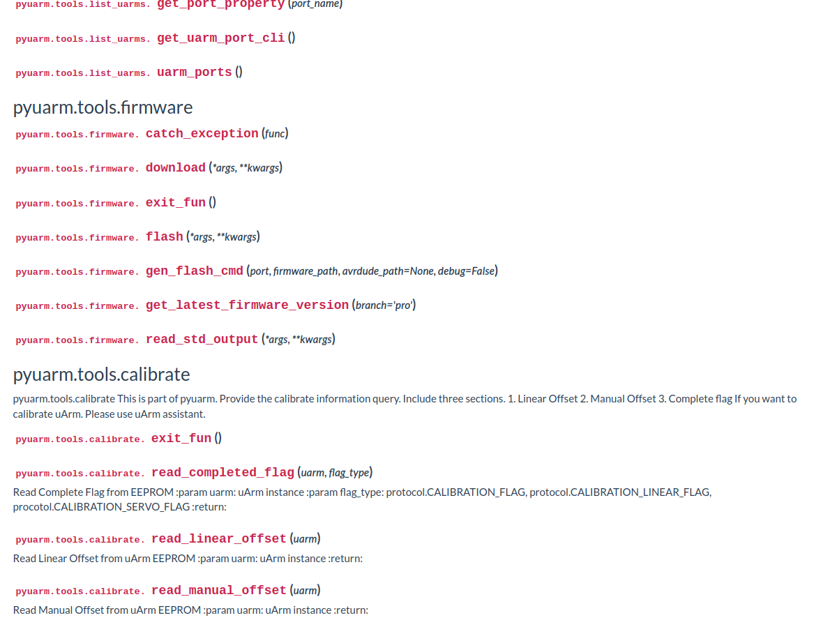
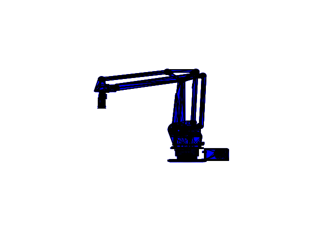
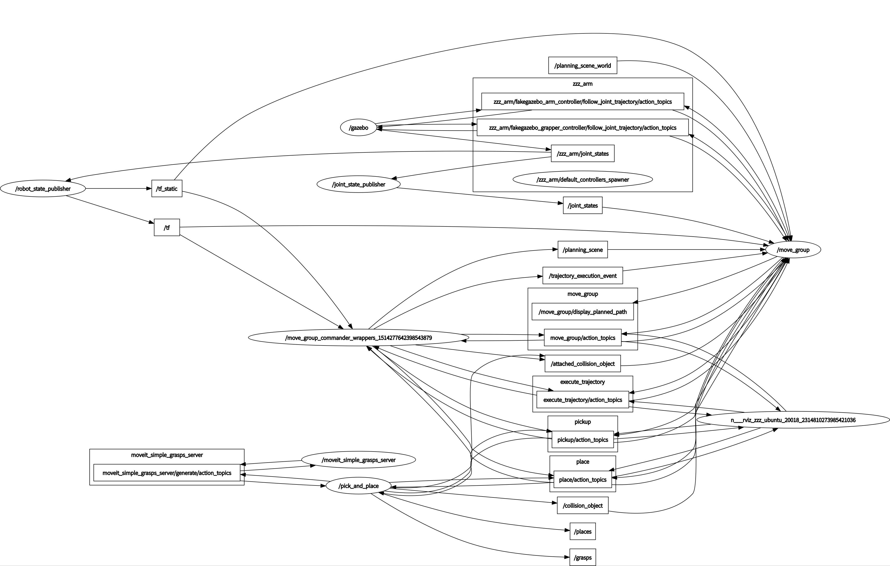
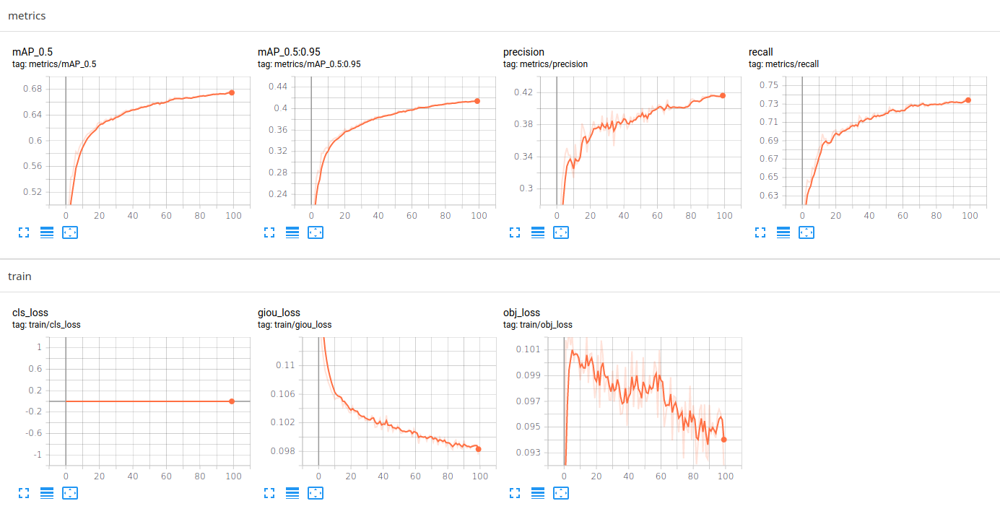
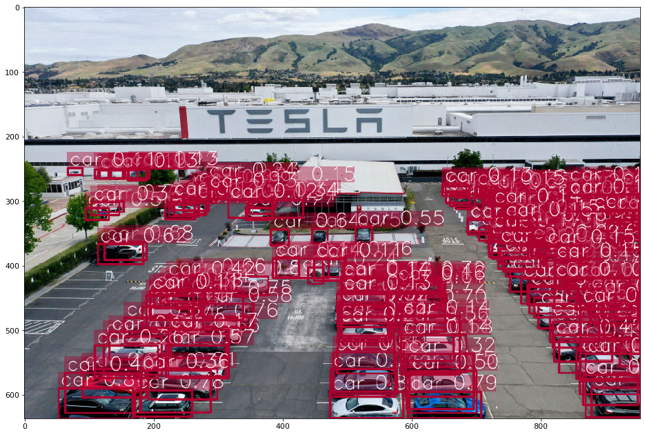

# TSO_project

[](https://www.codacy.com/gh/abstractguy/TSO_project/dashboard?utm_source=github.com&amp;utm_medium=referral&amp;utm_content=abstractguy/TSO_project&amp;utm_campaign=Badge_Grade)

[](https://hits.seeyoufarm.com)

[](https://www.python.org/)

[](http://commonmark.org)

[](https://www.gnu.org/software/bash/)

[](https://gcc.gnu.org/)

[](http://ForTheBadge.com)

[](http://ansicolortags.readthedocs.io/?badge=latest)


[](https://GitHub.com/abstractguy/TSO_project)

[](https://GitHub.com/abstractguy/TSO_project)

[](https://opensource.org/licenses/BSD-2-Clause)

[English version](https://github.com/abstractguy/TSO_project/tree/master/README.md)

### Un bras robotisé "intelligent" utilisant une caméra pour le prélèvement et le placement.
[](https://www.codacy.com/gh/abstractguy/TSO_project/dashboard?utm_source=github.com&amp;utm_medium=referral&amp;utm_content=abstractguy/TSO_project&amp;utm_campaign=Badge_Grade)

### Le problème
Les bras robotiques utilisant des capteurs de proximité sont notoirement inefficaces pour la tâche de prélèvement et de placement. Les capteurs de proximité ne permettent pas à l'utilisateur de sélectionner la catégorie d'objets à déplacer. De plus, ils ne parviennent pas à estimer la position exacte de l'objet en un seul passage sans recourir à une longue procédure de balayage, équivalente à celle d'un aveugle demandant à son chien de lui dire où se trouvent les clés de la voiture en parcourant tout le terrain à pied.

### La solution
Au lieu de cela, les progrès contemporains en matière de vision industrielle permettent à la machine de localiser et de saisir l'objet complexe directement après un seul regard, en temps réel, sans avoir recours à des capteurs unidimensionnels à proximité immédiate.

<a href="../../issues/new">:speech_balloon: Posez une question</a> &nbsp;&nbsp;&nbsp;&nbsp;&nbsp;&nbsp;&nbsp;&nbsp; <a href="../../issues?q=is%3Aissue+is%3Aclosed+sort%3Aupdated-desc">:book: Lisez les questions</a>
</h2>

### Le résumé
Un ordinateur de développement préconfiguré (scripts d'auto-installation et documentation inclus) se connecte par SSH à un Nvidia Jetson Nano préconfiguré (scripts d'auto-installation et documentation inclus) avec une caméra Raspberry Pi v2.1 ou un Arducam Camarray Hat (scripts d'auto-installation et documentation inclus). Un seul est attaché par un câble ruban MIPI de 1 mètre avec une extension répétitrice à l'extrémité du uArm. Le Jetson contrôlé par USB devient l'unité centrale de contrôle dans cette topologie. Le x86_64 (mais il pourrait s'agir d'autres architectures) flashe le micrologiciel sur le microcontrôleur ESP32 (soudé sur le circuit imprimé conçu par Altium) via un autre port USB. Ce micrologiciel (sans entrer dans les détails ou les extras pour l'instant) écoute l'UART pour le GCODE qu'il exécute ensuite et effectue en utilisant 3 sorties de modulation de largeur d'impulsion vers 4 servomoteurs propriétaires (la seule partie du uArm qui n'a pas été (re)définie dans ce projet). 4 entrées analogiques fournissent un retour d'angle au firmware. La valve est reliée à VCC pour économiser les broches et la pompe est pilotée par un GPIO en inversant les niveaux logiques. Le uARM (le nom du bras robotique utilisé dans ce projet) s'initialise à une position au milieu de la plage d'angle de son servomoteur. Il peut être contrôlé en utilisant GCODE à partir de l'UART pour ramasser des objets en utilisant des coordonnées absolues, relatives ou polaires (les coordonnées polaires simplifient les PIDs des axes X et Y et sont normalisées en gradins pour représenter la gamme entière du uArm par tous les axes mis à l'échelle par une gamme de +/- 100). Il peut ensuite ramasser une seule classe sélectionnée d'objets communs étiquetés à partir de l'ensemble de données COCO (80 classes) et d'un tas de trucs d'apprentissage automatique [voir software/jetson/fastmot/] (https://github.com/abstractguy/TSO_project/tree/master/software/jetson/fastmot/), en utilisant le retour d'information de la détection par réseau neuronal d'une caméra. Il place et dépose ensuite l'objet à un endroit prédéfini et boucle...

### TODO si vous voulez l'utiliser avec votre propre microcontrôleur (revoir les presets avant d'implémenter les vôtres !)
- [ ] Ajouter un #ifdef pour identifier les broches PWM, ADC et GPIO de votre microcontrôleur dans uArmPin.h dans UArmForArduino (seulement nécessaire si votre application n'utilise pas le même pinout)
- [ ] Si votre microcontrôleur ne définit pas de timers, ajoutez-le à la version modifiée de la bibliothèque Servo Arduino avec l'extension slowmove en la comparant avec l'implémentation AVR (AtMega) fournie qui a été ajoutée (pas nécessaire mais recommandé)
- Utilisez les méthodes grab() et drop() de pyuarm pour compléter le pick and place dans le processus set_servos() (seul le fetch, la partie la plus difficile, est réglé dans la boucle principale).
- [ ] Si vous voulez que le uArm ait des objets de perspective et de saisie, il est recommandé de reconvertir les coordonnées polaires (longueur, angle, hauteur) en coordonnées cartésiennes (x, y, z) (fonctions de réutilisation dans pyuarm) pour faire correspondre exactement les coordonnées de la caméra et de la portée du uArm (les portées entières étaient activées, mais ne correspondaient pas à la position initiale de la caméra en coordonnées cartésiennes).
- Régler la hauteur de la position initiale pour mettre à l'échelle la vue de la caméra et enregistrer les coordonnées de portée du uArm et de la caméra de manière égale.

## N'oubliez pas de consulter la documentation dans les CLIQUEZ-MOI ci-dessous !

## Documentation
La timeline du projet a été obtenue avec la commande suivante
``Bash
$ git log --pretty=format :"%h %ad | %s %d [%an]" --date=short >log.txt
```
[Chronologie du projet](https://github.com/abstractguy/TSO_project/tree/master/documentation/log.txt)

[Rapports](https://github.com/abstractguy/TSO_project/tree/master/documentation/)

## Compiler le code et la documentation sur le site Web

Pour compiler et déployer des parties du code précédemment commenté sous forme de site web sur readthedocs ou localement, cliquez sur le lien ci-dessous.
Remarque : étant donné que l'impact de cette opération sur mes notes était minime et que le commentaire de code nécessaire prenait du temps, toute la documentation ne sera pas affichée sur le site Web.

[Installer la documentation comme site web](https://docs.readthedocs.io/en/stable/development/install.html)

## Mécanique

 Les fichiers *.STL peuvent être imprimés en 3D
 
 [ici](mechanics/)

Cela n'a pas été tenté car je n'aurais pas le temps d'assembler les pièces.
Elle est cependant disponible.

## Simulation

Les fichiers *.STL peuvent être convertis en *.URDF pour être simulés à l'aide d'un moteur physique comme Gazebo (ou affichés à l'aide de RVIZ) dans ROS Kinetic, le tout au sein de Docker 

[voir les instructions dans software/jetson/jetson-containers/README.md](https://github.com/abstractguy/TSO_project/tree/master/software/jetson/jetson-containers/README.md)



Si vous ajoutez les plugins Moveit, la simulation peut fonctionner avec l'uARM en tandem. Si vous ajoutez ensuite openai-gym au conteneur ROS, vous pouvez brancher cet environnement à FERM, en remplaçant le xArm par le uArm. C'était le plan C, qui n'a pas été achevé, car l'attention s'est portée sur la mise en œuvre des plans A et B. J'ai seulement exécuté les mouvements physiques et de simulation séparément dans ROS et j'ai mis le plan de côté par manque de temps et de points.

FERM](https://github.com/PhilipZRH/ferm)

## Électronique

Le circuit imprimé minimaliste comporte un ESP32 comme microcontrôleur de pilotage du moteur.
Les fichiers de conception Altium sont fournis.

[dossier électronique/](https://github.com/abstractguy/TSO_project/tree/master/electronics/)

Le microcontrôleur est un module ESP32-WROOM-32 standard. Un CP2109 USB to serial chip est utilisé pour le programmer et transférer les données depuis un connecteur Micro-USB. Un emplacement pour carte SD non utilisé est disponible si une mémoire externe supplémentaire est nécessaire. Un régulateur abaisseur MCP16311T-E/M prélève 12 volts sur le connecteur jack pour fournir les 5 volts nécessaires au fonctionnement des servomoteurs. Un régulateur Low-Dropout à sortie fixe de type Complementary Metal Oxide Semiconductor (TC1264) prélève 5 volts sur le connecteur USB pour fournir 3,3 volts aux autres circuits. Une diode électroluminescente confirme que le régulateur fournit les 3,3 volts. Il y a une LED contrôlable par GPIO et un bouton poussoir branché sur un autre GPIO. Un autre bouton poussoir est branché sur la broche EN pour activer le module ESP32-WROOM-32.

## Logiciel


Il y a un logiciel compatible PC (Windows, MACOSX, Linux, Raspbian, autres saveurs ARM, etc.) avec des pilotes pour programmer et déployer l'environnement pour tout commander depuis le Jetson (ou l'ordinateur). Le firmware pour le PCB (compatible avec un certain nombre d'architectures) est fourni ci-dessous.

[firmware](https://github.com/abstractguy/TSO_project/tree/master/software/arduino-1.8.13/)

Le code principal a été testé sur PC et Jetson pour faciliter les tests modulaires pendant la programmation. La qualité et la reproductibilité du code sont les marques de fabrique de ce projet.

## Firmware uArm basé sur le GCode en C++

Le firmware est portable sur toutes les cartes Arduino (il fonctionne sur les microcontrôleurs AVR, SAM, SAMD, NRF52, STM32F4, ESP32 et ESP32-S2). Seules les définitions des broches ci-dessous doivent être redéfinies afin de supporter votre microcontrôleur personnalisé.

[ici](https://github.com/abstractguy/TSO_project/tree/master/software/arduino-1.8.13/portable/sketchbook/libraries/UArmForArduino/src/uArmPins.h)

Certains presets ont été définis pour AVR, ESP32 et ESP32-S2. Le script ci-dessous automatise le processus de flashage.
[software/jetson/install/flash_firmware_custom.sh](https://github.com/abstractguy/TSO_project/tree/master/software/jetson/install/flash_firmware_custom.sh)

Voir software/arduino-1.8.13/portable/sketchbook/libraries/UArmForArduino/README.md](https://github.com/abstractguy/TSO_project/software/arduino-1.8.13/portable/sketchbook/libraries/UArmForArduino/README.md) pour plus d'explications.

## Bibliothèques de servomoteurs portables et améliorées pour Arduino en C++.

Le firmware est portable sur toutes les cartes Arduino (il fonctionne sur les microcontrôleurs AVR, SAM, SAMD, NRF52, STM32F4, ESP32 et ESP32-S2). Ceci est dû au fait que les servomoteurs ont été rendus portables pour la bibliothèque originale de servo Arduino. En outre, la bibliothèque ESP32Servo est automatiquement sélectionnée avec le gestionnaire de cartes ; les architectures susmentionnées seront automatiquement sélectionnées au cours de cette étape. Une extension slowmove a été ajoutée à AVR, permettant l'assouplissement des mouvements avec l'interpolation bicubique (montré par le *.gif ci-dessus). Voir ci-dessous pour plus d'explications.

[software/arduino-1.8.13/portable/sketchbook/libraries/Servo/readme.md et software/arduino-1.8.13/portable/sketchbook/libraries/ESP32Servo/README.md](https://github.com/abstractguy/TSO_project/tree/master/software/arduino-1.8.13/portable/sketchbook/libraries/ESP32Servo/README.md)

## ArduCAM Camarray ou caméra Raspberry Pi v2.1 (au choix, mais la caméra RPi est moins expansive et nécessite moins d'installations).


Une procédure d'installation automatisée et une manipulation sans heurts pour le code du pilote, le tout compatible avec les frameworks V4L2 et Gstreamer, permettant des tests d'inférence plus rapides, plus faciles et interchangeables à l'aide d'images, de vidéos, de quelques protocoles de streaming réseau, de caméras supportées par V4L2 (MIPI, USB, etc.), etc., tous accessibles via la même interface.

## Contrôleur de port série personnalisé uARM basé sur GCODE en Python-3.7

Un contrôleur personnalisé communiquant avec le microprogramme de l'uARM à l'aide d'un protocole GCODE via une connexion USB au port série fournit un positionnement en coordonnées polaires absolues à échelle graduée pour un contrôle facile. Il y a un assouplissement bicubique, une extension slowmove, un calibrage, un enregistrement et une relecture des mouvements, etc.

## Gestion du multithreading et du multi-processus.


Pour un traitement parallèle plus rapide et plus simple de l'ensemble de l'écosystème, la boucle de processus du point d'entrée principal fonctionne avec des programmes parallèles, à l'exclusion du programme gestionnaire : la boucle principale de caméra/inférence, un contrôleur PID pour l'axe X, un contrôleur PID pour l'axe Y et le processus de contrôle uARM. L'entrée de la caméra est optionnellement filtrée de 4 façons (pas de filtrage, video get, video show et les deux).

## Inférence accélérée utilisant TensorRT et Numba, déployable sur les plateformes Nvidia Jetson.


Une plateforme comprenant YOLOv4-mish-640, le suivi de flux optique KLT, la compensation de mouvement de la caméra, un filtre de Kalman, l'association de données (...), avec des instructions pour l'entraînement et l'évaluation et l'inférence déployable sur un Nvidia Jetson (Nano ou AGX Xavier) en utilisant TensorRT et Numba.

## Documentation et instructions supplémentaires.

<details><summary><b>CLICK ME</b> - Prérequis matériels</summary>.

##### Prérequis matériels pour le Jetson Nano
    - Carte micro SD avec au moins 16 Go de stockage.
    - PC hôte Ubuntu* avec emplacement pour carte SD ou lecteur/enregistreur de carte SD USB
    - Kit de développement Jetson Nano avec alimentation micro USB (au moins 5V, 2A) ou alimentation CC (5V 4A)
    - Écran Full HD avec HDMI
    - Clavier et souris
    - Câble Ethernet connecté à l'Internet, ou adaptateur Wi-Fi USB
    - Soit un chapeau de réseau de caméras Arducam, soit la caméra Raspberry Pi v2.1 (recommandé)

* Vous pouvez utiliser un PC hôte Windows pour flasher la carte microSD, mais ce tutoriel utilise Ubuntu car le processus est plus simple. Voir le guide de NVIDIA pour une option Windows.
</details>

<details><summary><b>CLICK ME</b> - Pré-requis logiciels (tous installés automatiquement)</summary>.

- CUDA>=10
- cuDNN>=7
- TensorRT>=7
- OpenCV>=3.3
- PyCuda
- Numpy>=1.15
- Scipy>=1.5
- TensorFlow<2.0 (pour le support SSD)
- Numba==0.48
- cython-bbox
- pyserial

</details>

<details><summary><b>CLICK ME</b> - Instructions matérielles pour le Jetson Nano Devkit B01 (la révision précédente de la carte est également indiquée)</summary>.


- Insérez la carte microSD dans l'emplacement approprié
- Connectez l'écran et le clavier/souris USB et le câble Ethernet.
- En fonction de l'alimentation que vous souhaitez utiliser, vous devrez peut-être ajouter ou retirer le cavalier pour la sélection de l'alimentation :
- Si vous utilisez une prise jack, le cavalier doit être réglé.
- Si vous utilisez l'USB, le cavalier doit être désactivé.
- Branchez l'alimentation électrique. La LED verte (D53) près du port micro USB doit devenir verte et l'écran doit afficher le logo NVIDIA avant que le démarrage ne commence.
- Vous voudrez installer un cavalier sur J48 pour alimenter avec le barillet jack.
</details>

<details><summary><b>CLICK ME</b> - Instructions d'installation From Scratch pour Linux (passez directement à "Télécharger et installer le live *.iso" si l'installation de Linux est nécessaire et revenez ici juste après l'installation)</summary>.

##### Dépendances
    Aucune qui ne soit pas couverte par ce guide.

##### Mettez à jour les références des paquets du dépôt apt (assurez vous que le système sera à jour)
``Bash
$ sudo apt update
```

##### Installer git
```Bash
$ sudo apt install -y git
```

##### Créer le répertoire de l'espace de travail de base
```Bash
$ mkdir -p ~/workspace
```

##### Aller dans le répertoire de l'espace de travail de base
```Bash
$ cd ~/workspace
```

##### Télécharger le code du référentiel
``Bash
$ git clone https://github.com/abstractguy/TSO_project.git
```

##### Aller sur le chemin du logiciel de l'unité centrale de TSO_project
```Bash
$ cd TSO_project/software/jetson
```
</details>

<details><summary><b>CLICK ME</b> - Téléchargez et installez le live *.iso d'Ubuntu 18.04.5 LTS pour x86_64 (depuis ici https://unetbootin.github.io)</summary>.

##### Si vous utilisez déjà Linux :
``Bash
$ sudo -H bash install/install_unetbootin.sh
```

##### Sinon, si vous utilisez Windows, téléchargez et installez le live *.iso d'Ubuntu 18.04.5 LTS pour x86_64 à partir d'ici : https://unetbootin.github.io

### Mettre à jour et redémarrer (refaire les premières étapes sautées si vous commencez sur un système nouvellement installé)

### Commencez par une nouvelle installation d'Ubuntu 18.04.5 LTS avec les mises à jour automatiques et les pilotes propriétaires activés (n'activez pas le démarrage sécurisé par la méthode d'installation USB car cela peut être fait plus tard)

##### Activez Hyper-V dans le menu de démarrage UEFI pour la prise en charge des machines virtuelles lors du redémarrage.

##### Téléchargez Windows 10 Enterprise Edition pour VirtualBox (https://developer.microsoft.com/en-us/windows/downloads/virtual-machines/)

##### Installer VirtualBox 6.1.22 pour l'exécution des programmes Windows 10
``Bash
$ cd ~/workspace/TSO_project/software/jetson && bash install/install_virtualbox.sh
```

##### Installez le pack d'extension téléchargé automatiquement en cliquant dessus

##### Vous pouvez maintenant utiliser Windows 10 Enterprise Edition pour exécuter des applications Windows 10 à partir d'un hôte Linux, comme Altium pour le développement de circuits imprimés.

##### Installer les composants Nvidia pour JetPack 4.4
``Bash
$ sudo -H bash ~/workspace/TSO_project/software/jetson/install/install_jetpack_prerequisites.sh
```

### Après le redémarrage prescrit, examinez software/jetson/install/INSTALL_DOCKER.md et suivez la procédure complète

## Installer les pré-requis pour le développement de Python3

##### Installer miniconda3
``Bash
$ cd && bash ~/workspace/TSO_project/software/jetson/install/install_conda.sh
```

##### Installer l'environnement conda
```Bash
$ cd ~/workspace/TSO_project/software/jetson && bash install/install_conda_environment.sh
```
</details>

<details><summary><b>CLICK ME</b> - Flashage du firmware uArm</summary>.

##### Flash le uARM avec le firmware personnalisé
``Bash
$ cd ~/workspace/jetson && bash install/flash_uarm_custom.sh
```

##### Ou flasher l'uARM avec l'ancien firmware
```Bash
$ cd ~/workspace/jetson && bash install/flash_uarm.sh
```


##### Si vous flashez le uARM avec l'ancien firmware, vous devez recalibrer (vérifiez le bon port tty !)

##### Dans l'attente d'un appui sur le bouton D7, placez la pompe directement sur la table, le uARM face au centre de son axe en X.

##### En attendant d'appuyer sur le bouton D4, placez la pompe directement sur la table, le uARM aligné à 45 degrés (pi/4 rad) par rapport à l'extrémité du sens horaire.
``Bash
$ sudo /opt/conda/envs/school/bin/python3 -m pyuarm.tools.calibration.calibrate --port /dev/ttyUSB0
```
</details>

<details><summary><b>CLICK ME</b> - Instructions d'installation du Devkit Jetson Nano ou AGX Xavier (JetPack-4.4)</summary>.

### Si vous utilisez le Nvidia Jetson AGX Xavier Devkit, connectez-vous pour installer le sdkmanager de Nvidia à partir de https://developer.nvidia.com/nvsdk-manager.

### Sinon, si vous utilisez le Nvidia Jetson Nano Devkit, flashez la carte Micro-SD, puis branchez la carte Micro-SD.
```Bash
$ cd software/jetson && bash install/install_jetson_nano_sd_card.sh
```


### Suivez les instructions sur l'écran ou tapez ceci ci-dessous, après avoir branché une souris, un clavier, un écran HDMI et le type de connecteur réseau que vous avez choisi.
``Bash
$ screen /dev/ttyACM0
```

#### Si vous ne parvenez pas à vous connecter en SSH à la Jetson, c'est que vous avez sauté l'étape précédente ; refaites-la et l'installation reprendra après

##### Créez le répertoire workspace sur le Jetson (à partir du x86_64)
``Bash
$ ssh sam@192.168.55.1 'mkdir -p ~/workspace' (en anglais)
```

##### Préparer les répertoires sur le Jetson (à partir du x86_64)
``Bash
$ scp -r ~/workspace/TSO_project/software/jetson sam@192.168.55.1:/home/sam/workspace
```

##### Installer les pré-requis Jetson (remplacer <JETSON_PASSWORD> par le mot de passe de votre utilisateur Jetson)
``Bash
$ ssh -t sam@192.168.55.1 'cd ~/workspace/jetson && bash install/install_jetson.sh <JETSON_PASSWORD>''.
```
</details>

<details><summary><b>CLICK ME</b> - Installation de Docker pour Ubuntu 18.04 sur Jetson (pas nécessaire)</summary>.

Assurez-vous d'avoir installé [nvidia-docker](https://docs.nvidia.com/datacenter/cloud-native/container-toolkit/install-guide.html#docker). L'image nécessite une version du pilote NVIDIA >= 450. Construisez et exécutez l'image docker :
  ``Bash
  $ cd ~/workspace/jetson
  $ docker build -t project:latest .
  $ docker run --rm --gpus all -it -v /tmp/.X11-unix:/tmp/.X11-unix -e DISPLAY=unix$DISPLAY project:latest
  ```
</details>

<details><summary><b>CLICK ME</b> - Inférence</summary>

 

## Description
L'utilisation de FastMOT comme tracker personnalisé d'objets multiples (ici post-traité pour les objets uniques) met en œuvre :
  - Détecteur YOLO
  - Détecteur SSD
  - SORT profond + OSNet ReID
  - Suivi du flux optique KLT
  - Compensation du mouvement de la caméra
  - Support des modèles YOLOv4 à l'échelle
  - DIoU-NMS pour YOLO (+1% MOTA)
  - Conteneur Docker fourni sur Ubuntu 18.04

Les modèles d'apprentissage profond sont généralement le goulot d'étranglement de Deep SORT, ce qui rend Deep SORT inutilisable pour les applications en temps réel. FastMOT accélère considérablement l'ensemble du système pour qu'il fonctionne en **temps réel**, même sur Jetson. Il offre également suffisamment de flexibilité pour ajuster le compromis vitesse/précision sans modèle léger.

Pour obtenir un traitement plus rapide, FastMOT n'exécute le détecteur et l'extracteur de caractéristiques que toutes les N images. Le flux optique est utilisé pour combler les lacunes. YOLOv4 a été entraîné sur CrowdHuman (82% mAP@0.5) tandis que les SSD sont des modèles COCO pré-entraînés à partir de TensorFlow. OSNet surpasse l'extracteur de caractéristiques original dans Deep SORT. FastMOT réidentifie également les cibles qui sont sorties du cadre et conserve les mêmes identifiants. 

Le détecteur et l'extracteur de caractéristiques utilisent tous deux le backend **TensorRT** et effectuent une inférence asynchrone. En outre, la plupart des algorithmes, y compris le filtre de Kalman, le flux optique et l'association de données, sont optimisés en utilisant Numba.

## Performance
### Résultats sur le jeu d'entraînement MOT20
| Detector Skip | MOTA | MOTP | IDF1 | IDS | MT | ML |
|:-------:|:-------:|:-------:|:-------:|:-------:|:-------:|:-------:|
| N = 1 | 63.3% | 72.8% | 54.2% | 5821 | 867 | 261 |
| N = 5 | 61.4% | 72.2% | 55.7% | 4517 | 778 | 302 |

### FPS on MOT17 sequences
| Sequence | Density | FPS |
|:-------|:-------:|:-------:|
| MOT17-13 | 5 - 30  | 38 |
| MOT17-04 | 30 - 50  | 22 |
| MOT17-03 | 50 - 80  | 15 |

Les performances sont évaluées avec YOLOv4 en utilisant [py-motmetrics](https://github.com/cheind/py-motmetrics). Notez que ni YOLOv4 ni OSNet n'ont été entraînés ou affinés sur le jeu de données MOT20, les résultats de l'ensemble d'entraînement devraient donc pouvoir être généralisés. Les résultats FPS sont obtenus sur Jetson Xavier NX. 

FastMOT a des scores MOTA proches des trackers **state-of-the-art** du MOT Challenge. La vitesse de suivi peut atteindre jusqu'à **38 FPS** selon le nombre d'objets. Sur un CPU/GPU de bureau, les FPS devraient être beaucoup plus élevés. Des modèles plus légers peuvent être utilisés pour obtenir un meilleur compromis.

Utilise des poids pré-entraînés par COCO pour faire des prédictions sur les images, mais vous pouvez [entraîner votre propre YOLOv4] (https://github.com/AlexeyAB/darknet). 
Le tableau ci-dessous montre les temps d'inférence lors de l'utilisation d'images à l'échelle 608x608 comme entrées. Les mesures prises par YOLOv4 montrent le temps d'inférence de cette implémentation sur Nvidia Jetson AGX Xavier.

| Backbone | GPU | FPS (max lissée) | mAP@0.5 |
| ----------------------- |:----------:|:------------------:|:-------:|
| YOLOv4-608 | AGX Xavier | 34 | 65.7 |
| YOLOv4-mish-640 | AGX Xavier | 25 | 67.9 |

**IoU** (intersect over union) - moyenne de l'intersect over union des objets et des détections pour un certain seuil = 0.24

**mAP** (mean average precision) - valeur moyenne des `précisions moyennes` pour chaque classe, où la `précision moyenne` est la valeur moyenne de 11 points sur la courbe PR pour chaque seuil possible (chaque probabilité de détection) pour la même classe (Precision-Recall en termes de PascalVOC, où Precision=TP/(TP+FP) et Recall=TP/(TP+FN) ), page-11 : http://homepages.inf.ed.ac.uk/ckiw/postscript/ijcv_voc09.pdf

**mAP** est la métrique de précision par défaut dans la compétition PascalVOC, **c'est la même métrique que AP50** dans la compétition MS COCO.
En termes de Wiki, les indicateurs Precision et Recall ont une signification légèrement différente de celle du concours PascalVOC, mais **IoU a toujours la même signification**.


YOLOv4x-mish-640


YOLOv4-608
>

#### Les résultats de la formation ressemblent à ceci
<p align="center"></p>>

#### Visualisez avec tensorboard.
``Bash
$ tensorboard --logdir=runs
```
<p align="center"></p>

<p align="center"></p> <p align="center">.
<p align="center"></p> <p align="center">.
</details>

<details><summary><b>CLICK ME</b> - Modèles pré-entraînés</summary>.

Il existe des fichiers de poids pour différents fichiers cfg (entraînés pour le jeu de données MS COCO) :

FPS sur RTX 2070 (R) et Tesla V100 (V) :

* [yolov4x-mish.cfg](https://raw.githubusercontent.com/AlexeyAB/darknet/master/cfg/yolov4x-mish.cfg) - 640x640 - **67.9% mAP@0.5 (49.4% AP@0.5:0.95) - 23(R) FPS / 50(V) FPS** - 221 BFlops (110 FMA) - 381 MB : [yolov4x-mish.weights](https://github.com/AlexeyAB/darknet/releases/download/darknet_yolo_v4_pre/yolov4x-mish.weights) 
  * poids pré-entraînés pour l'entraînement : https://github.com/AlexeyAB/darknet/releases/download/darknet_yolo_v4_pre/yolov4x-mish.conv.166

* [yolov4-csp.cfg](https://raw.githubusercontent.com/AlexeyAB/darknet/master/cfg/yolov4-csp.cfg) - 202 MB : [yolov4-csp.weights](https://github.com/AlexeyAB/darknet/releases/download/darknet_yolo_v4_pre/yolov4-csp.weights) papier [Scaled Yolo v4](https://arxiv.org/abs/2011.08036)

    Changez simplement les paramètres `width=` et `height=` dans le fichier `yolov4-csp.cfg` et utilisez le même fichier `yolov4-csp.weights` pour tous les cas :
  * `width=640 height=640` dans le cfg : **66.2% mAP@0.5 (47.5% AP@0.5:0.95) - 70(V) FPS** - 120 (60 FMA) BFlops
  * `width=512 height=512` dans le cfg : **64.8% mAP@0.5 (46.2% AP@0.5:0.95) - 93(V) FPS** - 77 (39 FMA) BFlops
  * Poids pré-entraînés pour l'entraînement : https://github.com/AlexeyAB/darknet/releases/download/darknet_yolo_v4_pre/yolov4-csp.conv.142

* [yolov4.cfg](https://raw.githubusercontent.com/AlexeyAB/darknet/master/cfg/yolov4.cfg) - 245 MB : [yolov4.weights](https://github.com/AlexeyAB/darknet/releases/download/darknet_yolo_v3_optimal/yolov4.weights) (miroir Google-drive [yolov4.weights](https://drive.google.com/open?id=1cewMfusmPjYWbrnuJRuKhPMwRe_b9PaT) ) papier [Yolo v4](https://arxiv.org/abs/2004.10934)
    Changez simplement les paramètres `width=` et `height=` dans le fichier `yolov4.cfg` et utilisez le même fichier `yolov4.weights` pour tous les cas :
  * `width=608 height=608` dans le cfg : **65.7% mAP@0.5 (43.5% AP@0.5:0.95) - 34(R) FPS / 62(V) FPS** - 128.5 BFlops
  * `width=512 height=512` dans le cfg : **64.9% mAP@0.5 (43.0% AP@0.5:0.95) - 45(R) FPS / 83(V) FPS** - 91.1 BFlops
  * `width=416 height=416` dans le cfg : **62.8% mAP@0.5 (41.2% AP@0.5:0.95) - 55(R) FPS / 96(V) FPS** - 60.1 BFlops
  * `width=320 height=320` dans le cfg : **60% mAP@0.5 ( 38% AP@0.5:0.95) - 63(R) FPS / 123(V) FPS** - 35.5 BFlops

* [yolov4-tiny.cfg](https://raw.githubusercontent.com/AlexeyAB/darknet/master/cfg/yolov4-tiny.cfg) - **40.2% mAP@0.5 - 371(1080Ti) FPS / 330(RTX2070) FPS** - 6.9 BFlops - 23.1 MB : [yolov4-tiny.weights](https://github.com/AlexeyAB/darknet/releases/download/darknet_yolo_v4_pre/yolov4-tiny.weights)

* [enet-coco.cfg (EfficientNetB0-Yolov3)](https://raw.githubusercontent.com/AlexeyAB/darknet/master/cfg/enet-coco.cfg) - **45.5% mAP@0.5 - 55(R) FPS** - 3.7 BFlops - 18.3 MB : [enetb0-coco_final.weights](https://drive.google.com/file/d/1FlHeQjWEQVJt0ay1PVsiuuMzmtNyv36m/view)

* [yolov3-openimages.cfg](https://raw.githubusercontent.com/AlexeyAB/darknet/master/cfg/yolov3-openimages.cfg) - 247 Mo - 18(R) FPS - Jeu de données OpenImages : [yolov3-openimages.weights](https://pjreddie.com/media/files/yolov3-openimages.weights)

### Modèles Yolo v3
* [csresnext50-panet-spp-original-optimal.cfg](https://raw.githubusercontent.com/AlexeyAB/darknet/master/cfg/csresnext50-panet-spp-original-optimal.cfg) - **65.4% mAP@0.5 (43.2% AP@0.5:0.95) - 32(R) FPS** - 100.5 BFlops - 217 MB : [csresnext50-panet-spp-original-optimal_final.weights](https://drive.google.com/open?id=1_NnfVgj0EDtb_WLNoXV8Mo7WKgwdYZCc)

* [yolov3-spp.cfg](https://raw.githubusercontent.com/AlexeyAB/darknet/master/cfg/yolov3-spp.cfg) - **60.6% mAP@0.5 - 38(R) FPS** - 141.5 BFlops - 240 MB : [yolov3-spp.weights](https://pjreddie.com/media/files/yolov3-spp.weights)

* [csresnext50-panet-spp.cfg](https://raw.githubusercontent.com/AlexeyAB/darknet/master/cfg/csresnext50-panet-spp.cfg) - **60.0% mAP@0.5 - 44 FPS** - 71.3 BFlops - 217 MB : [csresnext50-panet-spp_final.weights](https://drive.google.com/file/d/1aNXdM8qVy11nqTcd2oaVB3mf7ckr258-/view?usp=sharing)

* [yolov3.cfg](https://raw.githubusercontent.com/AlexeyAB/darknet/master/cfg/yolov3.cfg) - **55.3% mAP@0.5 - 66(R) FPS** - 65.9 BFlops - 236 MB : [yolov3.weights](https://pjreddie.com/media/files/yolov3.weights)

* [yolov3-tiny.cfg](https://raw.githubusercontent.com/AlexeyAB/darknet/master/cfg/yolov3-tiny.cfg) - **33.1% mAP@0.5 - 345(R) FPS** - 5.6 BFlops - 33.7 MB : [yolov3-tiny.weights](https://pjreddie.com/media/files/yolov3-tiny.weights)

* [yolov3-tiny-prn.cfg](https://raw.githubusercontent.com/AlexeyAB/darknet/master/cfg/yolov3-tiny-prn.cfg) - **33.1% mAP@0.5 - 370(R) FPS** - 3.5 BFlops - 18.8 MB : [yolov3-tiny-prn.weights](https://drive.google.com/file/d/18yYZWyKbo4XSDVyztmsEcF9B_6bxrhUY/view?usp=sharing)

### Modèles Yolo v2
* `yolov2.cfg` (194 MB COCO Yolo v2) - nécessite 4 GB GPU-RAM : https://pjreddie.com/media/files/yolov2.weights
* `yolo-voc.cfg` (194 MB VOC Yolo v2) - nécessite 4 GB GPU-RAM : http://pjreddie.com/media/files/yolo-voc.weights
* `yolov2-tiny.cfg` (43 MB COCO Yolo v2) - nécessite 1 GB GPU-RAM : https://pjreddie.com/media/files/yolov2-tiny.weights
* `yolov2-tiny-voc.cfg` (60 MB VOC Yolo v2) - nécessite 1 GB GPU-RAM : http://pjreddie.com/media/files/yolov2-tiny-voc.weights
* `yolo9000.cfg` (186 MB Yolo9000-model) - nécessite 4 GB GPU-RAM : http://pjreddie.com/media/files/yolo9000.weights

### Plus d'options peuvent être configurées dans cfg/mot.json
  - Définissez la `résolution` et le `frame_rate` qui correspondent aux données sources ou à la configuration de la caméra (facultatif). Ils sont requis pour la séquence d'images, les sources de caméra et l'évaluation du défi MOT. Listez toutes les configurations pour votre caméra USB/CSI :
    ``Bash
    $ v4l2-ctl -d /dev/video0 --list-formats-ext
    ```
  - Pour changer de détecteur, modifiez `detector_type`. Cela peut être soit `YOLO`, soit `SSD`.
  - Pour changer de classe, définissez `class_ids` sous le bon détecteur. La classe par défaut est `1`, qui correspond à la personne
  - Pour changer de modèle, modifiez `model` sous un détecteur. Pour SSD, vous pouvez choisir entre `SSDInceptionV2`, `SSDMobileNetV1`, ou `SSDMobileNetV2`.
  - Notez qu'avec SSD, le détecteur divise une image en tuiles et les traite par lots pour une meilleure précision. Changez `tiling_grid` en `[2, 2]`, `[2, 1]`, ou `[1, 1]` si vous préférez une taille de lot plus petite.
  - Si vous souhaitez plus de précision et que la puissance de traitement n'est pas un problème, réduisez `detector_frame_skip`. De même, augmentez `detector_frame_skip` pour accélérer le suivi au détriment de la précision. Vous pouvez également vouloir modifier `max_age` de sorte que `max_age × detector_frame_skip ≈ 30`.

</details>

<details><summary><b>CLICK ME</b> - Suivi des classes personnalisées</summary>.

FastMOT prend en charge le suivi multi-classes et peut être facilement étendu aux classes personnalisées (par exemple, le véhicule). Vous devez entraîner à la fois YOLO et un modèle ReID sur vos classes d'objets. Consultez [Darknet](https://github.com/AlexeyAB/darknet) pour entraîner YOLO et [fast-reid](https://github.com/JDAI-CV/fast-reid) pour entraîner ReID. Après l'entraînement, convertissez le modèle au format ONNX et placez-le dans fastmot/models. Pour convertir YOLO en ONNX, utilisez [tensorrt_demos](https://github.com/jkjung-avt/tensorrt_demos/blob/master/yolo/yolo_to_onnx.py) pour être compatible avec les plugins YOLO de TensorRT.
### Ajouter des YOLOv3/v4 personnalisés
1. Sous-classez `YOLO` comme ici : https://github.com/GeekAlexis/FastMOT/blob/4e946b85381ad807d5456f2ad57d1274d0e72f3d/fastmot/models/yolo.py#L94
    ```
    ENGINE_PATH : chemin vers le moteur TensorRT (converti à l'exécution)
    MODEL_PATH : chemin vers le modèle ONNX
    NUM_CLASSES : nombre total de classes
    LETTERBOX : conserver le rapport d'aspect lors du redimensionnement
               Pour YOLOv4-csp/YOLOv4x-mish, mettre à True.
    NEW_COORDS : paramètre new_coords pour chaque couche yolo
                Pour YOLOv4-csp/YOLOv4x-mish, défini sur True.
    INPUT_SHAPE : taille d'entrée au format "(channel, height, width)".
    LAYER_FACTORS : facteurs d'échelle par rapport à la taille d'entrée pour chaque couche yolo.
                   Pour YOLOv4/YOLOv4-csp/YOLOv4x-mish, définissez-les à [8, 16, 32].
                   Pour YOLOv3, définir [32, 16, 8].
                   Pour YOLOv4-tiny/YOLOv3-tiny, réglez sur [32, 16].
    SCALES : paramètre scale_x_y pour chaque couche yolo
            Pour YOLOv4-csp/YOLOv4x-mish, définissez-le à [2.0, 2.0, 2.0].
            Pour YOLOv4, définissez-le à [1.2, 1.1, 1.05].
            Pour YOLOv4-tiny, réglez sur [1.05, 1.05].
            Pour YOLOv3, réglez sur [1., 1., 1.].
            Pour YOLOv3-tiny, réglez sur [1., 1., 1.].
    ANCRES : ancres regroupées par chaque couche yolo
    ```
    Notez que les ancres peuvent ne pas suivre le même ordre dans le fichier cfg de Darknet. Vous devez masquer les ancres pour chaque couche yolo en utilisant les indices dans `mask` dans Darknet cfg.
    Contrairement à YOLOv4, les ancres sont généralement inversées pour YOLOv3 et tiny.
2. Remplacez les étiquettes de classe [ici] (https://github.com/GeekAlexis/FastMOT/blob/master/fastmot/models/label.py) par vos classes d'objets.
3. Modifiez cfg/mot.json : mettez `model` dans `yolo_detector` à la classe Python ajoutée et mettez `class_ids` que vous voulez détecter. Vous pouvez jouer avec `conf_thresh` en fonction de la précision de votre modèle.
### Ajouter un ReID personnalisé
1. Sous-classez `ReID` comme ici : https://github.com/GeekAlexis/FastMOT/blob/aa707888e39d59540bb70799c7b97c58851662ee/fastmot/models/reid.py#L51
    ```
    ENGINE_PATH : chemin vers le moteur TensorRT (converti au moment de l'exécution)
    MODEL_PATH : chemin vers le modèle ONNX
    INPUT_SHAPE : taille de l'entrée au format "(canal, hauteur, largeur)".
    OUTPUT_LAYOUT : dimension de la caractéristique produite par le modèle (par exemple 512)
    METRIC : métrique de distance utilisée pour faire correspondre les caractéristiques ('euclidienne' ou 'cosinus')
    ```
2. Modifiez cfg/mot.json : mettez `model` dans `feature_extractor` à la classe Python ajoutée. Vous pouvez vouloir jouer avec `max_feat_cost` et `max_reid_cost` - valeurs flottantes de `0` à `2`, en fonction de la précision de votre modèle.
</details>

<details><summary><b>CLICK ME</b> - Dernières étapes</summary>

##### Télécharger le jeu de données COV pour la calibration INT8
Nécessaire uniquement si vous voulez utiliser le SSD (pas dans ce cas).
``Bash
$ install/download_data.sh
```

##### Télécharger les modèles
Ceci inclut les modèles OSNet pré-entraînés, SSD, et les modèles personnalisés YOLOv4 WEIGHTS/ONNX.
```Bash
$ cd ~/workspace/jetson && bash install/download_models.sh
```

##### Convertir yolov4x-mish-640 de Darknet *.weights en ONNX *.onnx
```Bash
$ #cd ~/workspace/jetson && python3 utils/convert_DarkNet_to_ONNX.py --darknet-weights ./fastmot/models/yolov4.weights --onnx-weights . /fastmot/models/yolov4.onnx --cfg ./utils/cfg/yolov4.cfg --image-shape 608 608 --names ./utils/cfg/coco.names --batch-size 1 --add-plugins
$ cd ~/workspace/jetson && python3 utils/yolo_to_onnx.py --model fastmot/models/yolov4x-mish-640 --category_num 80
```

##### Sur votre TV, ouvrez un terminal et exécutez tout ce qu'il faut pour convertir yolov4x-mish-640 de ONNX *.onnx en TensorRT *.trt et lancer l'inférence
``Bash
$ cd ~/workspace/jetson && sudo python3 main.py --test-type nano
$ cd ~/workspace/jetson && sudo python3 main.py --test-type xavier
$ cd ~/workspace/TSO_project/software/jetson && sudo /opt/conda/envs/school/bin/python3 main.py --test-type x86_64
```
</details>

### Utilisation des tests multimédia
- Webcam USB :
  ```Bash
  $ sudo python3 main.py --input_uri /dev/video0
  ```
- Caméra MIPI CSI :
  ```Bash
  $ sudo python3 main.py --input_uri csi://0
  ```
- Flux RTSP :
  Sur l'hôte :
  ``Bash
  $ #ffmpeg -re -loop -1 -i /dev/video0 -c copy -f rtsp -rtsp_transport tcp rtsp://localhost:1337/live.sdp
  $ vlc v4l2:///dev/video0 --sout '#transcode {vcodec=h264,acodec=mp3,samplerate=44100}:std{access=http,mux=ffmpeg{mux=h264},dst=127.0.0.1:1337/live.sdp}''.
  ```
  Sur le périphérique :
  ```Bash
  $ #sudo python3 main.py --input_uri rtsp://<user>:<password>@<ip>:<port>/<path>
  $ sudo python3 main.py --input_uri rtsp://samuel@192.168.55.100:1337/live.sdp
  ```
- Flux HTTP :
  ``Bash
  $ sudo python3 main.py --input_uri http://<user>:<password>@<ip>:<port>/<path>
  ```
- Séquence d'images :
  ``Bash
  $ sudo python3 main.py --input_uri img_%06d.jpg
  ```
- Fichier vidéo :
  ``Bash
  $ sudo python3 main.py --input_uri video.mp4
  ```
- Utilisez `--help` pour l'aide et `--output_uri` pour sauvegarder la sortie.
- Pour désactiver le backend GStreamer, mettez `WITH_GSTREAMER = False` [ici](https://github.com/GeekAlexis/FastMOT/blob/3a4cad87743c226cf603a70b3f15961b9baf6873/fastmot/videoio.py#L11)
- Notez que la première exécution sera lente à cause de la compilation Numba.

## Autres README.md dans d'autres répertoires
- [software/arduino-1.8.13/README.md](https://github.com/abstractguy/TSO_project/software/arduino-1.8.13/README.md)
- [software/jetson/jetson-containers/README.md](https://github.com/abstractguy/TSO_project/software/jetson/jetson-containers/README.md)
- [software/arduino-1.8.13/portable/sketchbook/libraries/UArmForArduino/README.md](https://github.com/abstractguy/TSO_project/software/arduino-1.8.13/portable/sketchbook/libraries/UArmForArduino/README.md)
- [software/arduino-1.8.13/portable/sketchbook/libraries/Servo/docs/readme.md](https://github.com/abstractguy/TSO_project/software/arduino-1.8.13/portable/sketchbook/libraries/Servo/docs/readme.md)
- [software/arduino-1.8.13/portable/sketchbook/libraries/ESP32Servo/README.md](https://github.com/abstractguy/TSO_project/software/arduino-1.8.13/portable/sketchbook/libraries/ESP32Servo/README.md)

## Credit

### GeekAlexis/FastMOT
[[Inférence FastMOT]](https://github.com/GeekAlexis/FastMOT)

### FastReID
[[FastReID]](https://github.com/JDAI-CV/fast-reid)

### AlexeyAB/darknet
[[Entraînement YOLOv4 et statistiques]](https://github.com/AlexeyAB/darknet)

### jktjung-avt/tensorrt_demos
[[Fonctions de conversion]](https://github.com/jkjung-avt/tensorrt_demos)

### ceccocats/tkDNN
[[Performance graphique]](https://github.com/ceccocats/tkDNN)

### Démonstration de caméra
[[Démonstration de la caméra]](https://www.arducam.com/docs/camera-for-jetson-nano/mipi-camera-modules-for-jetson-nano/camera-demonstration/#0--1hardware-connection-)

### Convertir des pages web en markdown pour les consulter sur Github
[[HTML-to-Markdown]](http://heckyesmarkdown.com/)

### STL vers GIF
[[STL vers GIF]](https://github.com/DAguirreAg/STL-to-gif)

### Documents de référence

[[Document de Yolov3]](https://arxiv.org/abs/1804.02767)

[[Document Yolov4]](https://arxiv.org/abs/2004.10934)

[[Document SPP]](https://arxiv.org/abs/1406.4729)

[[Document CSPNet]](https://arxiv.org/abs/1911.11929)

[[Article sur le SORT profond avec association profonde]](https://arxiv.org/abs/1703.07402)

[[FastReID]](https://arxiv.org/abs/2006.02631)

[[Apprentissage de caractéristiques à échelle multiple pour la réidentification de personnes]](https://arxiv.org/abs/1905.00953)

[[Apprentissage de représentations omniéchelles généralisables pour la réidentification de personnes]](https://arxiv.org/abs/1910.06827)

[[TorchReID]](https://arxiv.org/abs/1910.10093)

[[KLT tracking]](http://cseweb.ucsd.edu/classes/sp02/cse252/lucaskanade81.pdf)

[[Filtrage de Kalman]](https://www.cs.unc.edu/~welch/kalman/media/pdf/Kalman1960.pdf)

