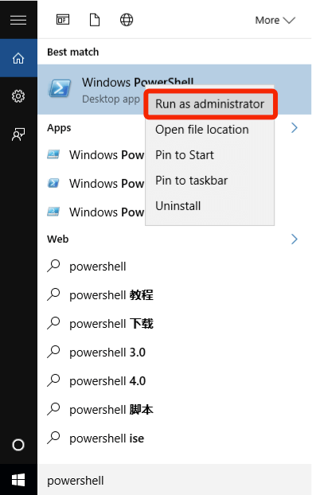
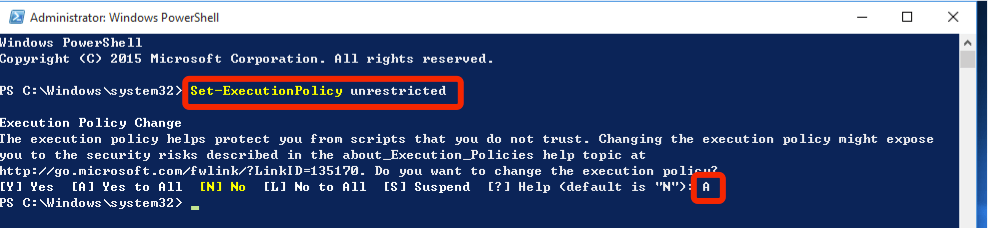
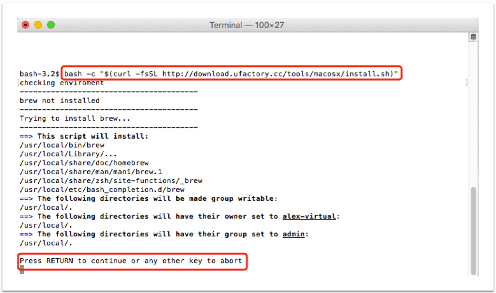
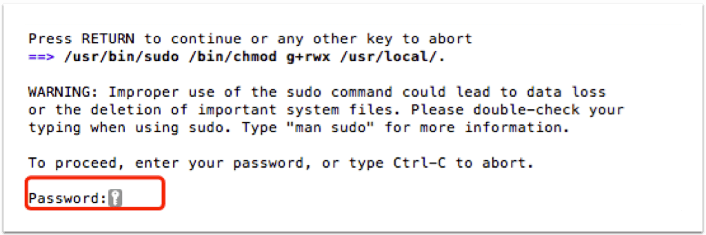
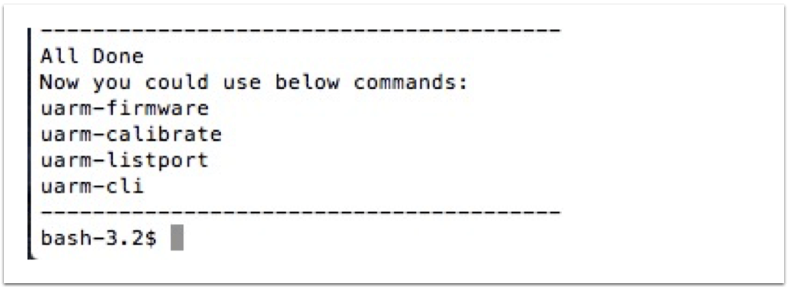

## Windows

This guide would help you install all the environment uArm Tools need in windows.

### Requirement

- Windows 7 or above
- Administrator privilege

### Online installation script
- Open Powershell with Administrator  
<center></center>
<center>Run as administrator</center>  
- Please input the command to change the Powershell executionpolicy `Set-ExecutionPolicy unrestricted`, Press "A" to approve  

Powershell script execution policy default is restrict, it means that doesn't allow any script running. please refer [Get-ExecutionPolicy](https://go.microsoft.com/fwlink/?LinkID=135170)  

- input this online script `iex ((New-Object System.Net.WebClient).DownloadString('http://download.ufactory.cc/tools/windows/install.ps1'))`

** Install with Proxy **  
if your network quality doesn't well, it supports proxy.
please run this command before you execute the online script: `$env:chocolateyProxyLocation = 'http://address:port'`

what is the script actually did?
- chocolatey, Software Management. Automated. [https://chocolatey.org/][db374d94]
- Python2, (installed by chocolatey), uArm tools is based on python environment
- pip, (installed by chocolatey), this python tool will help us to download uArm tools.
- pyuarm, uArm python library include all python environment

  [db374d94]: https://chocolatey.org/ "https://chocolatey.org/"


### Tools usage

Now you could use below command in terminal

- `uarm-firmware` - upgrade your uArm firmware  
- `uarm-listport` - show all connected uArm  
- `uarm-calibrate` - calibrate uArm  
- `uarm-cli` - Console

## MacOS

##### Step 1 - Open `terminal.app`  


<center>Search `terminal.app` via Spotlight Search</center>

##### Step 2 - Enter Command to Start Installation

**Step 2.1 Copy & paste the command below to install uArm Enviroment:**

```
    bash -c "$(curl -fsSL http://download.ufactory.cc/tools/macosx/install.sh)"
```
<br>

<br>
- Press `Enter` in below message: _Press RETURN to continue or any other key to abort_
<br>
<br>

<br>
- Input your Mac user password
<br>
<br>
<br>
**Step 2.2 When the installation is finished, you will see the words below:**

<br>
<br>
**Step 2.3 After installation, you could use commands below:**    
- `uarm-listport` - show all connected uArm  
- `uarm-firmware` - upgrade your uArm firmware  
- `uarm-calibrate` - calibrate uArm
- `uarm-cli` - uArm Miniterm
<br>
