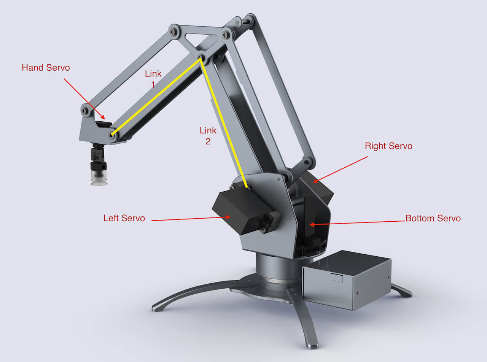
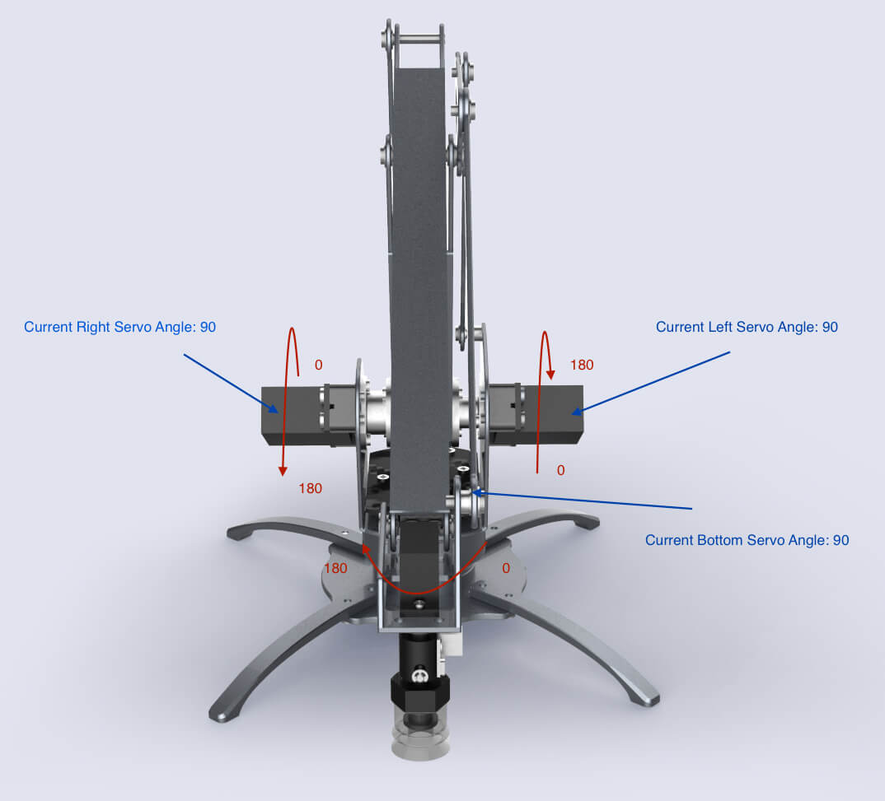
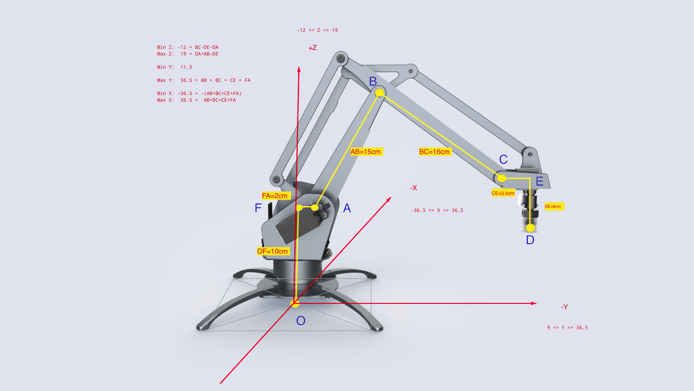
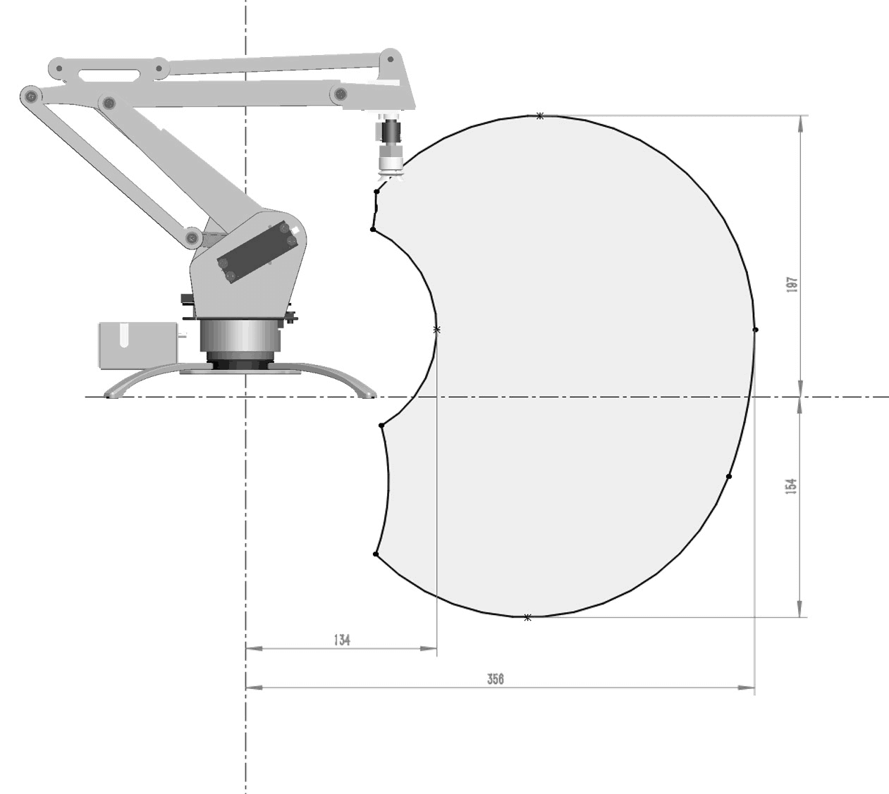

#  uArm Developer Knowledge Base

## Makers are from all jacks of life, so do uArm Masters!
We know you are a developer, but maybe you are an expert of Software Programming, a dedicated Industrial Designer or smart Mechanical Engineer,
who is curious about Robot and eager to learn. We aslo can see many of you are artists, and couldn't find a smart arm to help you to build your creative ideas.

**Here you GO!**

It doesn't matter your background, please arm in arm with us, and trust yourself you can make and hack with uArm.

This is the reason why we start the uArm Knowledge Base! It will simply brief you basic idea of Robots, mechanics concept of uArm, library we create,
 communication with Robots, and so on.

 Of course, as mentioned before, makers are from all jacks of life and everyone is an expert of your own field,
 so we also call for your help to make it a marvelous BASE for everyone to read, study, share, hack  and define your own uArm- Robot Arm :)


## uArm Developer Knowledge Base Introduction

Please update your uArm with our latest firmware at *Download Section* of the [page](https://ufactory.cc/cn/uarm_metal/) at the bottom, and it is included _uArm_ _Library_ and _uArm_ _Protocol_.
Once uArm is plugged in:


1. It will read your current angle of servos and attach all the servos.

  *If uArm has not been calibrated, it will alarm you with a long high pitch beep, and ask you to calibrate. You can use the calibration tool 'uarm-calibrate'*

2. uArm will automatically get ready and waiting for your command.
 Once you send the command (via uArm Protocol), it will automatically analyze it and act as related.
 If you would like to write your own uArm protol for communication, please refer to communication Protocol here?????

3. We **strongly recommend** you use the packaged APIs, because you don't have to understand those complicated Protocols
and serial programming. Our APIs are handy for you to use!

4. Hey, before you start your projects, please read and learn the info below. Hope they are helpful.

 **If you would like to add more, please dont hesitate to write down your ideas and thoughts on Github [uarmdocs](https://github.com/uf-team)!**


## Mechanical Motion

###  Servo-Motor control Schematics
uArm is controlled by 4 Servo, marked in the pic 1.0.

Pic1.0 Servo Control Schematics
- Servo 0 - Bottom Servo
Related with Arduino PWM PIN D11, Analog PIN 2
This servo is used to control uArm's base rotation.

- Servo 1 - Left Servo -
Related with Arduino PWM PIN D13，Analog PIN 0
Servo 2 - Right Servo
Related with Arduino PWM PIN D12, Analog PIN 1
These two servos are used to control *front arm*`Link1`and *back arm*`Link2`.

- Servo 3 - Hand Servo -
Related with Arduino PWM PIN D10, Analog PIN 3
This mini-servo is responsible for the rotation of end-effector of uArm, for example, Suction cup.

### Servo

When we talk about the servo control, we have to mention Arduino. Thanks to Arduino, we can have thousand open sourced libraries.
For uArm, our servo motor supports Arduino's *servo.h* library.

#### Servo Attach Detach  

Before using servo, it is a must to attach servos. At this time, servos will be locked.

#### Rotation Ranges of Servo
We use default functions for servo `servoWrite()`. The unit of its rotation is **degree**, ranging from `0` to `180`.

When assembling,  we install the servo to uArm with a fixed angle. In the pic 1.1, you can see the default angles for assemble.


1.1 servo angles and ranges
- Servo 0 is 90°, which is in the middle.
- Servo 1 and Servo 2 are all in the degree of 90
- Servo 3 90°.
Though the rotation range for servo is 0° to 180°,
due to the restriction of its Mechanical design, in fact, it can not cover such big range.

The picture **below** is the work range of Left and Right Servo, on the condition that only one servo is
working. The servo on the left can range from 0° to 150° and the one on the right is 20° to 150°.

The servo at the base and the mini servo on top can range 0° to 180°. Like the picture **below**


Now you can control the movement of uArm by read the servo's angle, but this is not visible,
and somehow dangerous. Because the linkage of servos may lock each other, it is a factor lead to `burn` the servo.
We would like to suggest you to construct a three dimention coordination. Please refer to "*Three Dimention Coordination*" in the **pic??????**.


### Read the servo angle
There is a build-in ADC (analog and digital convertor),
which can change the current analog signal into digital one.
And then, with he function `analogRead` which is defaulted in Arduino,
 the digital data can be read out and get the current
angle with this formula `intercept + analog * slope`.
The definition if _intercept_ and _slope_will be explained in detail in the part of "**Calibration**".

### Calibration

###### Why calibration?

1. First, the analog data ADC adopted is not accurate,
   what's more, the inaccuracy of analog data is different from each other,
   so we need to conduct the liner calibration once.
   - How we do this?
     - We will ask Servo move to a target position.
      During the `move to` process, the ADC will collect 5 average  Analog values-
      usually, one average analog value consists of over 100  sequent data collected by ADC.

    - Next, we will conduct a liner operation, and get the `intercept` and `slope`.


2. Second, we will install the servo with a fixed angle, like in the pic 1.0 Servo Control Schematics,
   but, the arm is install by HUMAN
   (we are dedicated to work out, possibly we can have uArm to insall new uArm and we need your help! HAHA!!!)


#### How to calibrate
This will be discussed in the section of DEVELOPER TOOLS.


### Three Dimention coordination
We start a Three Dimention coordination, because it is not visible and easy, but dangerous to control
the movement of uArm by the means of directly control the rotation of servos. Please refer to the pic1.2
below (unit-`CM`).

Pic1.2 Dimention Diagram


#### Point of Junction
- `O` Origional Point (0,0,0)
- `A` The middle point of Left/ Right Axis
- `B` The middle point between two screws--each screw is correspondently
    on one side of Link 2 as the linkage of Point B.
- `C` The middle point between two screws-- each screw is correspondently
    on one side of Link 2 as the linkage of Point C.
- `D` The Center Point on the bottom of Suction Cup.
- `E` It is an interaction of DE and CE, which are perpendicular to each other.
Like in the picture, DE is paralleled with coordinate axis Z and CE is paralleled
with coordinate axis Y.
- `F` It is an interaction of OF and AF, which are perpendicular to each other.
Like in the picture, OF is paralleled with coordinate axis Z and AF is paralleled
with coordinate axis Y.

#### Line
- `OA` Distance of Original Point `O` to the center of L/R axis `A`
- `OF` = 10CM Shadow of `OA` on coordinate axis +Z
- `AF` = 2CM  Shadow of `OA` on coordinate axis +Y
- `AB` = 14.8 CM Length of Link2
- `BC` = 16CM Length of Link1
- `CE` = 3.5 CM Front Part Length
- `DE` = 6CM Length of Suction Cup

#### Extreme/Limits
- [X] = [-36.5cm ~ 36.5cm ]
  - Max X = AB + BC + CD + AF
- [Y] = [11.5 cm ~ 36.5cm]
 -  MIN Y = 
 - Max Y = Max X
- [Z] = [-12cm ~ 19cm]
  - Max Z = OA + AB -DE
  - Min Z = BC - DE - OA


#### Work Range
You can imagine the work range with the Limits of XYZ, and the work range for uArm is not a regular area.
In the Pic1.3 you can see the actual work area of uArm. However, you might not know there are somewhere
 which is out of the work range, so we have set restrains for those places which uArm can not reach, and
 return an `Error`.
 
 Work Range Diagram of uArm

#### Accuracy and Offset
Theoretically, the offset is around `±0.5CM`. In fact, the range is related with the payload for uArm.
Servo has less offset when working in the range between `40°` and `140°`;
 but when it is less than  `40°` or greater than `140°`, the offset will become wider.

 **Pic1.4** is a pair of comparation between _Target Location_ and _Actual Location_,
 when servo is in between 0° and 180°.


## uArm Developer Tools Kit
Now lets see uArm Developer Tools Kit. The reason why we make developer Tools is that we hope our users can focus on developing cool projects, making more possibilities of uArm and achieve their purpose or great ideas of hacking!

It is written by python, so first of all, you need to insall uArm's working environment of Python.


### Installation Tutorial
### Windows

- As Python is not defaulted inside of Windows, if you want to use these developing tools, please INSTALL Python first. [Click here, download and install Python. ](python-download-link)
- Next, please install `pip`. We recommend [pip-for-windows][pip-for-windows-link]
- now you can install uArm' tool kit by sending the command `pip install pyuarm`.

  [python-download-link]: https://www.python.org/downloads/ "PythonDownloadLink"
  [pip-for-windows-link]: https://sites.google.com/site/pydatalog/python/pip-for-windows "pip-for-windows"


#### Mac
What you need:
- pip
- avrdude

Strongly recommend, because it is a really very convenient tool that you type only one install command:
```
bash -c "$(curl -fsSL http://download.ufactory.cc/tools/macosx/install.sh)"
```
This command will help you with the installation and very efficient:)

```
    bash -c "$(curl -fsSL http://download.ufactory.cc/tools/macosx/install.sh)"
```


If you would like to install by yourself, you can do so:
- First, idnstall pip - `sudo easy_install pip`
- Next, install pyuarm `pip install pyuarm`
- if you need to upgrade the firmware, you need to install `avrdude`-refer to [Homebrew][Homebrew-link], a quick and easy way to make it.
- Completing homebrew, you can start `brew install avrdude`.

  [Homebrew-link]: http://brew.sh "Homebrew"


#### Linux
What you need:
- pip
-avrdude

You can use the *installation tool* in the release version of Linux,
for example, in the *debain*, you can just use:
```
sudo apt-get install python-pip python-dev build-essential avrdude
```
After installation, you can use `pip install pyuarm` installation tools.

#### Tutorials

ONCE YOU COMPLETE INSTALLATION OF THE DEVELOPER TOOLS KIT, YOU CAN TRY:
- uarm-firmware upgrade and check the firmware version.
- uarm-calibrate Calibrate uArm
- uarm-listport Check the port/COM for uArm to use
- uarm-miniconsole A Software with Command Control Only (To-Do)
