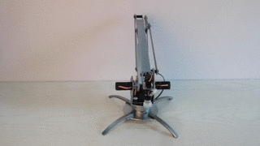
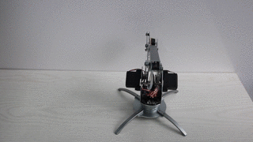

** Notice **
Please make sure you install the uArm cli before. please refer [uArm CLI](cli_installation.md)

# How to run cli?

## Windows


## uarm-listport

list all connected uArm ports.

eg.
```
    $ uarm-listport
    /dev/cu.usbserial-AI04I17F
    /dev/cu.usbserial-A6031WSQ
    2 ports found
```


## uarm-firmware

firmware helper could help you upgrade your uArm Firmware to latest version.

You could use `uarm-firmware -h` to list all the usage:

```
usage: uarm-firmware [-h] [-d] [-f [FORCE]] [-c [CHECK]] [-p [PORT]] [-u]

optional arguments:
  -h, --help            show this help message and exit
  -d, --download        download firmware into firmware.hex
  -f [FORCE], --force [FORCE]
                        without firmware path, flash default firmware.hex,
                        with firmware path, flash the firmware, eg. -f
                        Blink.ino.hex
  -c [CHECK], --check [CHECK]
                        remote - lateset firmware release version, local -
                        read uArm firmware version
  -p [PORT], --port [PORT]
                        provide port number
  -u, --upgrade         Upgrade firmware if remote version newer than local
                        version
```

- uarm-firmware -d

    This will download the latest firmware from [http://download.ufactory.cc/firmware.hex](http://download.ufactory.cc/firmware.hex)

    And you could find the latest version number here [http://download.ufactory.cc/version](http://download.ufactory.cc/version)

    eg.
```
    uarm-firmware -d
    [1] - /dev/cu.usbserial-A6031WSQ
    [2] - /dev/cu.usbserial-AI04I17F
    Please Choose the uArm Port: 2
    Downloading firmware.hex...
    Downloading: 100% [#########################################] Time: 0:00:01  50.41 kB/s
```

- uarm-firmware -f

    `-f` argument will force to flash the hex file to uArm with the port.  
    format: -f firmware_path
    if no firmware path provided, default use `firmware.hex`

    ```
    uarm-firmware -f
    ```
- uarm-firmware -u

    `-u or --upgrade` argument, will compare local uarm firmware with remote latest firmware version, if update version is available,
    you could upgrade the version

- uarm-firmware -p

    `-p` or `--port`, specify the port number. You could use `uarm-listport` to list the uarm ports first.
    eg.
    `uarm-firmware -p /dev/cu.usbserial-AI04I17F`
    you could combine with other
    `uarm-firmware -u -p /dev/cu.usbserial-AI04I17F`

## uarm-calibrate

   **If you bought the uArm Metal after April 2016, please DON’T calibrate it, because all uArm were already calibrated before sale. It might break uArm Metal with frequent calibration.**

   If you still need to calibrate your uArm. Please read this instruction carefully.

### Preparation  

   **Notice: While calibrating, uArm will turn and stretch itself to reach the correct positions (refer to PIC1). Some positions are located under the desk, so please make sure it is free from any object may be interrupt calibration process.**

#### Upgrade firmware to latest version

Make sure you have upgraded your firmware to latest version, you could use `uarm-firmware -c remote`

#### Working Area
<center></center>
<center>pic1. Don't stick uArm to Desktop</center>

<center></center>
<center>pic2. Correct Way in Desktop</center>


**Please make sure you have a clear Desktop. Below is calibration working area.**

<center>  </center>
<center>pic3. Calibration Area Height</center>

<center>  </center>
<center>pic4. Calibration Top Area</center>

### Start Calibration

Now we can startup calibration.

- Open terminal, input `uarm-calibrate`
- If your uArm has been calibrated, it will display the below message, If you still want to calibrate your uArm, Please press "Y" to continue  
```
    uarm-calibrate
    [1] - /dev/cu.usbserial-AI04I17F
    [2] - /dev/cu.usbserial-A6031WSQ
    Please Choose the uArm Port: 1
    Initialize uArm, port is /dev/cu.usbserial-AI04I17F...
    Firmware Version: 1.7.3
    uArm has been calibrated already, Are you sure want to Calibrate it again?
    Press Y if you want to calibrate anyway...
```
- When Calibration start, uArm will start to calibrate itself for each servo. (We call this Linear Calibration)
```
Press Y if you want to calibrate anyway...
Y
0. Clearing Completed Flag in EEPROM.
1.0. Clearing Linear Completed Flag in EEPROM.
1. Start Calibrate Linear Offset
    1.1. 0 Linear Offset - Servo 0
Servo Number: 0, Angle: 30, Analog: 170
Servo Number: 0, Angle: 31, Analog: 170
......
1.1. 1 Linear Offset - Servo 1
Servo Number: 1, Angle: 35, Analog: 193
Servo Number: 1, Angle: 36, Analog: 184
......
1.1. 2 Linear Offset - Servo 2
Servo Number: 2, Angle: 15, Analog: 123
Servo Number: 2, Angle: 16, Analog: 122
1.1. 3 Linear Offset - Servo 3
Servo Number: 3, Angle: 20, Analog: 125
Servo Number: 3, Angle: 21, Analog: 123
...
```
-  When Linear Calibration is finished, you will hear "beep beep beep" from uArm, And the console log like below.

```
Servo Number: 3, Angle: 159, Analog: 418
    1.2 Saving Servo Offset into EEPROM
Intercept Address:70, Offset Value:-22.0.
Slope Address:50, Offset Value:0.32.
Intercept Address:74, Offset Value:-19.27.
Slope Address:54, Offset Value:0.31.
Intercept Address:78, Offset Value:-22.84.
Slope Address:58, Offset Value:0.32.
Intercept Address:82, Offset Value:-35.06.
Slope Address:62, Offset Value:0.46.
    1.3 Mark Completed Flag in EEPROM
2.0. Clearing Servo Completed Flag in EEPROM.
2. Start Calibrate Servo Offset
Please move uArm in right position
Please move uArm to correct position, When complete, please press Enter to contine.
```

- Then Move uArm to the correct position.

    - Servo 0: 45 degree  
    - Servo 1: 130 degree  
    - Servo 2: 20 degree  

<center></center>
<center>pic5. move uArm to the correct position, Front view</center>

<center></center>
<center>pic6. move uArm to the correct position, Back view</center>

<center></center>
<center>pic7. Step1 move to 45 degrees</center>

<center></center>
<center>pic8. Step2 Push the arrow position</center>

- Press Enter to continue, Then it would display the each servo calibration offset value, like below
```
Please move uArm to correct position, When complete, please press Enter to contine.
servo offset, bottom: 1.12, left: -0.49, right: -11.86, hand: 1.35,
Confirm Please Press Y, Retry press Other Key:
```
- After you press Y and Enter, will save the offset value into uArm.
```
Confirm Please Press Y, Retry press Other Key: y
    2.1 Saving Servo Offset into EEPROM
    2.3 Mark Completed Flag in EEPROM
3.0. Clearing Stretch Completed Flag in EEPROM.
    3.1 Saving Stretch Offset into EEPROM
    3.2 Mark Completed Flag in EEPROM
Calibration DONE!!
```
- Congratulations! Calibration completed!

## uarm-miniterm

miniterm is a mini platform for you to accomplish basic controls of uArm by typing simple commands.

<script type="text/javascript" src="https://asciinema.org/a/auywv7m5df1ma2nkuzqblgflq.js" id="asciicast-auywv7m5df1ma2nkuzqblgflq" async></script>

- Enter uArm Miniterm
Enter `uarm-miniterm`, and you will see the following message (the format of the message may vary according to different operation systems):

```
$ uarm-miniterm
Welcome to use uArm Command Line - v0.1.3
Shortcut:
Quit: Ctrl + D, or input: quit
Clear Screen: Ctrl + L
```

Input help for more usage

- Connect with uArm
All commands will only work when a uArm is connected. If you are using commands without a uArm connected, you will receive the following message:

```
>>> mv
No uArm is connected, please use connect
```

Enter “connect” to connect uArm with miniterm. If there are more than one uArm connected with your computer, miniterm will ask you to choose one.

```
>>> connect
Initialize uArm, port is /dev/cu.usbserial-AI04I17F...
Firmware Version: 1.7.3
```

- Control uArm with commands
Enter “help” to see all commands enabled by the miniterm.


```
>>> help
uArm Command line Help Center

Please use connect before any control action
Shortcut:
Quit: Ctrl + D, or input: quit
Clear Screen: Ctrl + L

Documented commands (type help <topic>):
----------------------------------------
EOF    connect     firmware   gripper  mv    quit        servo
alarm  disconnect  get_coord  move_to  pump  read_angle  write_angle

Miscellaneous help topics:
--------------------------
msg

Undocumented commands:
----------------------
debug  help  set_polar
```

Example of command usage:
Enter help move_to and you will get instructions of using this command.

```
>>> help move_to

        move_to, move to destination coordinate.
        format: move_to X Y Z or move_to X Y Z S
        X,Y,Z unit centimeter, S time - default 2 sec
        eg. move_to 12 -12 12
```

- Quit miniterm
Press “Ctrl+D” or enter “quit” to quit anytime you want.
